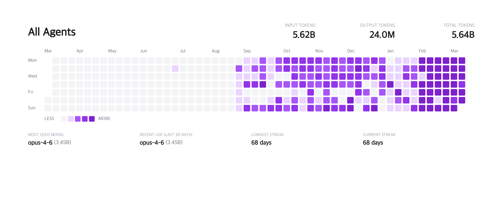
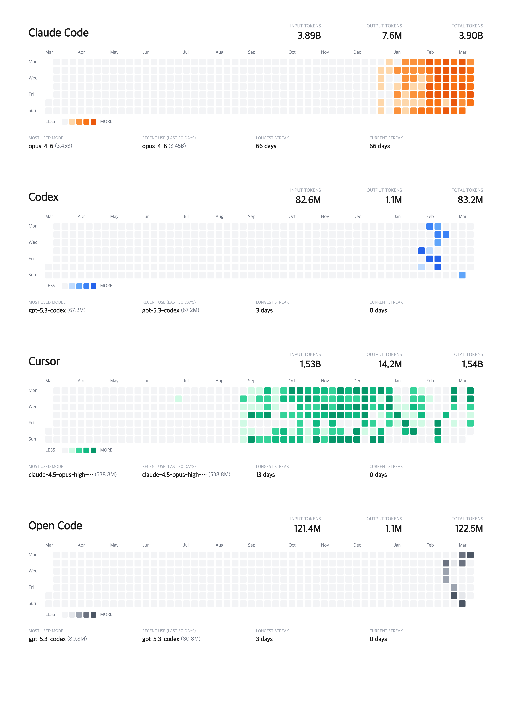
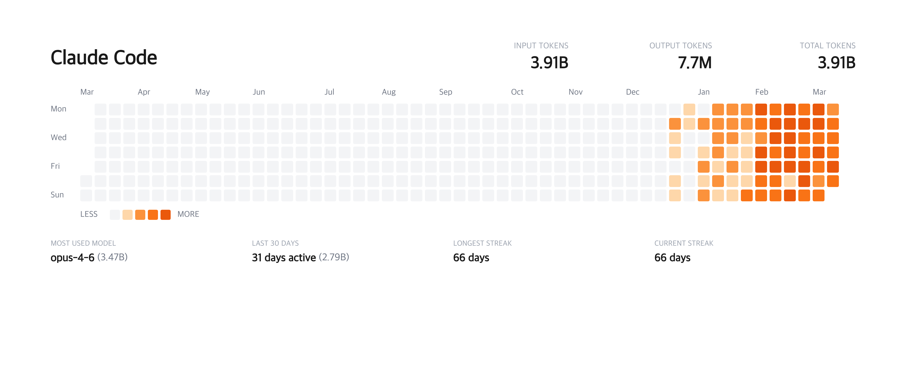

# agents-heatmap

GitHub-style activity heatmaps for AI coding agent token usage. Auto-detects **Claude Code**, **Codex CLI**, **Cursor**, and **OpenCode** from local data.

## Quick Start

```bash
bunx agents-heatmap
# or
npx agents-heatmap
# or
pnpm dlx agents-heatmap
```

Generates two PNG heatmap images in the current directory.

## Options

```bash
bunx agents-heatmap                    # both per-agent and combined images
bunx agents-heatmap --combined         # only the combined "All Agents" view
bunx agents-heatmap --separate         # only per-agent separate views
bunx agents-heatmap --claude           # only Claude Code
bunx agents-heatmap --claude --codex   # only Claude Code and Codex
```

Available provider flags: `--claude`, `--codex`, `--cursor`, `--opencode`

## Output

### Combined



### Per-agent



### Single provider



## Supported Agents

- **Claude Code** — reads from `~/.claude/`
- **Codex CLI** — reads from `~/.codex/`
- **Cursor** — auto-fetched from Cursor's dashboard API
- **OpenCode** — reads from `~/.local/share/opencode/opencode.db`
